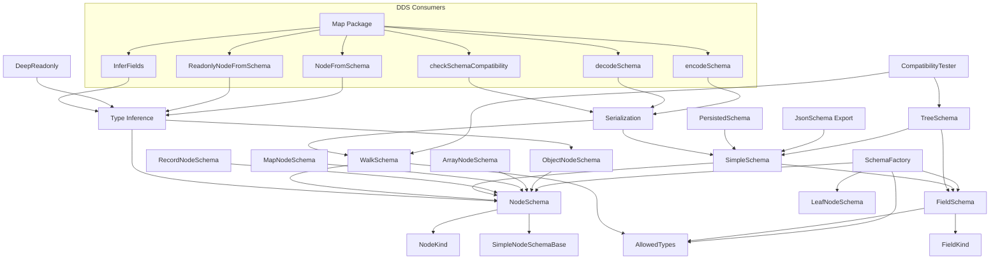

# Schema System Extraction Plan

> **Related Documents**:
> - [Schema Implementation Plan](./schema-implementation-plan.md) - Detailed implementation steps
> - [Schema DDS Integration Patterns](./schema-dds-integration.md) - General modality patterns
> - [SharedMap Schema Design](./schema-map-design.md) - Detailed SharedMap implementation
> - [SharedDirectory Schema Design](./schema-directory-design.md) - Detailed SharedDirectory implementation
> - [SharedString Schema Design](./schema-string-design.md) - Detailed SharedString implementation
> - [Open Items & Notes](./schema-open-items.md) - Open questions, risks, and concerns

## Executive Summary

This document outlines a plan to extract the user-defined schema capability from the `@fluidframework/tree` DDS package into a standalone, reusable package. The primary goal is to enable other DDSes (such as SharedMap, SharedDirectory, SharedString) to leverage the same schema definition, validation, and transformation capabilities, providing a unified schema experience across the Fluid Framework.

---

## 0. Evaluation: Suitability for Multi-DDS Reuse

### 0.1 Target Use Case: SharedMap with Schema

SharedMap currently has no schema system - it accepts `any` value types:
```typescript
interface ISharedMap extends Map<string, any> {
  get<T = any>(key: string): T | undefined;
  set<T = unknown>(key: string, value: T): this;
}
```

A schema-enabled SharedMap could look like:
```typescript
const sf = new SchemaFactory("myApp");
const myMapSchema = sf.map("UserPreferences", sf.string); // Map<string, string>

// Or with complex value types:
class UserProfile extends sf.object("UserProfile", {
  name: sf.string,
  age: sf.number,
});
const profileMapSchema = sf.map("ProfileMap", UserProfile);
```

### 0.2 What Works Well for Multi-DDS Reuse

✅ **Leaf Types** - `stringSchema`, `numberSchema`, `booleanSchema`, `nullSchema`, `handleSchema` are DDS-agnostic and directly reusable.

✅ **FieldKind** - `Required`, `Optional`, `Identifier` concepts apply to any structured data.

✅ **NodeKind** - The concept of different node kinds (Object, Array, Map, Leaf) maps well to different DDS structures.

✅ **Schema Metadata** - Descriptions, custom metadata, and persisted metadata are DDS-agnostic.

✅ **JSON Schema Export** - Generating JSON Schema from any schema definition is universally useful.

✅ **Simple Schema Layer** - The `SimpleTreeSchema`/`SimpleNodeSchema` abstraction is clean and DDS-agnostic.

✅ **Schema Walking** - Visitor pattern for traversing schema graphs is reusable.

### 0.3 Concerns and Required Changes

⚠️ **Tree-Specific Naming** - Current naming is tree-centric:
- `TreeNodeSchema` → should become `NodeSchema`
- `TreeViewConfiguration` → should become `SchemaConfiguration`
- `SimpleTreeSchema` → should become `SimpleSchema`

⚠️ **Tree-Specific Concepts** - Some concepts are tree-specific:
- `TreeFieldStoredSchema` - Fields are a tree concept (parent-child relationships)
- Recursive schema support - Important for trees, may not be needed for flat structures like SharedMap

⚠️ **Stored Schema Format** - The persisted schema format is tightly coupled to Tree DDS serialization. Other DDSes would need their own storage format but could share the logical schema representation.

⚠️ **Compatibility Checking** - The compatibility logic assumes tree structure. SharedMap would need simpler value-type compatibility checking.

### 0.4 DDS Schema Adoption Modalities

Any DDS adopting the extracted schema capabilities can choose from three progressive modalities:

#### Modality 1: API-Only Schema

Schema is used purely at the TypeScript API layer for compile-time type safety. The DDS owns reading/writing data in a format compatible with its existing (schema-less) API.

```
┌─────────────────────────────────────────────────────────────────────┐
│                         Application Code                             │
│  const map = SchemaMap.create(runtime, "users", UserProfile);       │
├─────────────────────────────────────────────────────────────────────┤
│                      Schema-Aware API Layer                          │
│  • Type-safe get<T>() / set<T>()                                    │
│  • Runtime validation on write (optional)                           │
│  • Schema used for TypeScript generics only                         │
├─────────────────────────────────────────────────────────────────────┤
│                    Existing DDS Storage Format                       │
│  • Data format unchanged from non-schema version                    │
│  • Backward compatible with existing documents                      │
│  • Schema NOT persisted                                              │
└─────────────────────────────────────────────────────────────────────┘
```

**Characteristics**:
- ✅ Full backward compatibility with existing documents
- ✅ Gradual adoption - can add schema to existing DDSes
- ✅ No migration required
- ⚠️ No runtime schema validation on load (trust the data)
- ⚠️ Schema changes not tracked in document

**Use Cases**: Adding type safety to SharedMap, SharedDirectory without breaking changes.

#### Modality 2: Persisted Schema (API + Schema Storage)

Extends API-Only by persisting the schema alongside the data. The data format remains compatible with the existing DDS format.

```
┌─────────────────────────────────────────────────────────────────────┐
│                         Application Code                             │
│  const map = SchemaMap.create(runtime, "users", UserProfile);       │
├─────────────────────────────────────────────────────────────────────┤
│                      Schema-Aware API Layer                          │
│  • Type-safe get<T>() / set<T>()                                    │
│  • Runtime validation on write                                       │
│  • Schema compatibility checking on load                            │
├─────────────────────────────────────────────────────────────────────┤
│                       DDS Storage Format                             │
│  ┌─────────────────────┐  ┌─────────────────────────────────────┐  │
│  │   Schema Blob       │  │   Data (existing format)            │  │
│  │   (JSON/binary)     │  │   Compatible with non-schema DDS    │  │
│  └─────────────────────┘  └─────────────────────────────────────┘  │
└─────────────────────────────────────────────────────────────────────┘
```

**Characteristics**:
- ✅ Schema versioning and compatibility checking
- ✅ Data format backward compatible with non-schema clients
- ✅ Schema evolution support (can detect incompatible changes)
- ⚠️ Non-schema clients can still write invalid data
- ⚠️ Schema blob adds storage overhead

**Use Cases**: Enabling schema validation while maintaining interop with older clients.

#### Modality 3: Schema-Validated Data (Full Schema Integration)

Extends Persisted Schema by also storing data in a schema-aware format that can be validated. May or may not be compatible with the existing DDS format.

```
┌─────────────────────────────────────────────────────────────────────┐
│                         Application Code                             │
│  const map = SchemaMap.create(runtime, "users", UserProfile);       │
├─────────────────────────────────────────────────────────────────────┤
│                      Schema-Aware API Layer                          │
│  • Type-safe get<T>() / set<T>()                                    │
│  • Runtime validation on read AND write                             │
│  • Full schema compatibility checking                                │
├─────────────────────────────────────────────────────────────────────┤
│                    Schema-Aware Storage Format                       │
│  ┌─────────────────────┐  ┌─────────────────────────────────────┐  │
│  │   Schema Blob       │  │   Data (schema-validated format)    │  │
│  │   (JSON/binary)     │  │   Type tags, validation metadata    │  │
│  └─────────────────────┘  └─────────────────────────────────────┘  │
│  • May NOT be compatible with existing non-schema DDS               │
│  • Enables full data integrity guarantees                           │
└─────────────────────────────────────────────────────────────────────┘
```

**Characteristics**:
- ✅ Full runtime validation on all operations
- ✅ Data integrity guaranteed by schema
- ✅ Rich type information in storage (polymorphism, etc.)
- ⚠️ May require migration from existing documents
- ⚠️ May not be compatible with non-schema clients
- ⚠️ Higher storage overhead

**Use Cases**: New DDSes designed with schema from the start; Tree DDS operates in this mode.

#### Modality Comparison

| Aspect | API-Only | Persisted Schema | Schema-Validated Data |
|--------|----------|------------------|----------------------|
| Type Safety | Compile-time | Compile-time + Load | Compile-time + Load + Runtime |
| Backward Compatible | ✅ Full | ✅ Data only | ⚠️ May require migration |
| Schema Stored | ❌ | ✅ | ✅ |
| Data Validated | ❌ | On write only | On read and write |
| Storage Overhead | None | Schema blob | Schema + type metadata |
| Non-schema Clients | ✅ Full interop | ⚠️ Can corrupt | ❌ Incompatible |

### 0.5 Recommended Architecture for Multi-DDS Support

The extracted `@fluidframework/schema` package provides the foundation that each DDS can build upon to implement any of the three modalities:

```
┌─────────────────────────────────────────────────────────────────────┐
│                    @fluidframework/schema                           │
│  Core schema primitives reusable across all DDSes & modalities      │
├─────────────────────────────────────────────────────────────────────┤
│  • SchemaFactory (leaf types, object, array, map definitions)       │
│  • NodeKind, FieldKind enums                                        │
│  • SimpleSchema types (DDS-agnostic representation)                 │
│  • Schema validation & walking                                       │
│  • JSON Schema export                                                │
│  • Schema serialization (for Modality 2 & 3)                        │
│  • Metadata support                                                  │
└─────────────────────────────────────────────────────────────────────┘
           │                    │                    │
           ▼                    ▼                    ▼
┌─────────────────┐  ┌─────────────────┐  ┌─────────────────┐
│ @ff/tree        │  │ @ff/map         │  │ @ff/string      │
│ Modality 3      │  │ Modality 1 or 2 │  │ (future)        │
├─────────────────┤  ├─────────────────┤  ├─────────────────┤
│ • TreeView      │  │ • SchemaMap<T>  │  │ • SchemaString  │
│ • Full schema   │  │ • Type-safe API │  │ • Segment types │
│   storage       │  │ • Optional      │  │                 │
│ • Hydration     │  │   persistence   │  │                 │
└─────────────────┘  └─────────────────┘  └─────────────────┘
```

### 0.6 Scope Recommendation

**Phase 1 (This Plan)**: Extract core schema primitives
- Focus on what's truly reusable across all modalities: types, leaf schemas, factory basics, JSON export
- Include schema serialization utilities (needed for Modality 2 & 3)
- Rename tree-specific names to generic names
- Keep Tree DDS working via re-exports

**Phase 2 (Future)**: Add SharedMap schema support (Modality 1)
- Create `SchemaMap<T>` wrapper for type-safe API
- Implement optional runtime validation on write
- Full backward compatibility with existing SharedMap documents

**Phase 3 (Future)**: SharedMap Modality 2 (Optional)
- Add schema persistence to SharedMap
- Schema compatibility checking on document load
- Data format remains compatible with non-schema clients

**Phase 4 (Future)**: Additional DDSes
- SharedDirectory (Modality 1 or 2 - nested map schema)
- SharedString (Modality 1 - segment type validation)
- New DDSes could start with Modality 3 (full schema integration)

---

## 1. Overview of the Existing Schema System

### 1.1 Architecture Layers

The Tree DDS schema system is organized into several distinct layers:

```
┌─────────────────────────────────────────────────────────────────────┐
│                         Public API Layer                             │
│  SchemaFactory, TreeViewConfiguration, getJsonSchema, etc.          │
├─────────────────────────────────────────────────────────────────────┤
│                       Simple Schema Layer                            │
│  SimpleTreeSchema, SimpleNodeSchema, SimpleFieldSchema              │
├─────────────────────────────────────────────────────────────────────┤
│                         Core Schema Layer                            │
│  TreeNodeSchema, FieldSchema, AllowedTypes, NodeKind                │
├─────────────────────────────────────────────────────────────────────┤
│                       Stored Schema Layer                            │
│  TreeStoredSchema, TreeNodeStoredSchema, TreeFieldStoredSchema      │
└─────────────────────────────────────────────────────────────────────┘
```

### 1.2 Key Components

#### 1.2.1 Schema Definition (src/simple-tree/api/)

- **SchemaFactory** ([schemaFactory.ts](../packages/dds/tree/src/simple-tree/api/schemaFactory.ts))
  - Primary API for creating schema definitions
  - Provides methods for creating object, array, map, and leaf schemas
  - Manages scoping and naming of schema identifiers
  - Includes built-in leaf types: `string`, `number`, `boolean`, `null`, `handle`

- **SchemaStatics** ([schemaStatics.ts](../packages/dds/tree/src/simple-tree/api/schemaStatics.ts))
  - Static schema definitions shared across all SchemaFactory instances
  - Defines primitive leaf types and field creation utilities

- **SchemaFactoryAlpha/Beta** ([schemaFactoryAlpha.ts](../packages/dds/tree/src/simple-tree/api/schemaFactoryAlpha.ts), [schemaFactoryBeta.ts](../packages/dds/tree/src/simple-tree/api/schemaFactoryBeta.ts))
  - Extended schema factory with alpha/beta features
  - Includes staged schema upgrades and advanced type annotations

#### 1.2.2 Field Schema ([fieldSchema.ts](../packages/dds/tree/src/simple-tree/fieldSchema.ts))

- **FieldKind** enum: `Optional`, `Required`, `Identifier`
- **FieldSchema** class with:
  - Allowed types constraint
  - Metadata support
  - Default value providers
  - Stored key mapping

#### 1.2.3 Node Kind Schemas (src/simple-tree/node-kinds/)

- **ObjectNodeSchema** - Structured objects with named fields
- **ArrayNodeSchema** - Ordered collections
- **MapNodeSchema** - Key-value collections with string keys
- **RecordNodeSchema** - Record-like structures
- **LeafNodeSchema** ([leafNodeSchema.ts](../packages/dds/tree/src/simple-tree/leafNodeSchema.ts)) - Primitive values

#### 1.2.4 Simple Schema Layer ([simpleSchema.ts](../packages/dds/tree/src/simple-tree/simpleSchema.ts))

A "Simple Schema" abstraction that provides:
- **SimpleTreeSchema** - Complete tree schema representation
- **SimpleNodeSchema** - Union of all node schema types
- **SimpleFieldSchema** - Simplified field representation
- **SchemaType** enum distinguishing `View` vs `Stored` schema

#### 1.2.5 Core Schema Types (src/simple-tree/core/)

- **TreeNodeSchema** ([treeNodeSchema.ts](../packages/dds/tree/src/simple-tree/core/treeNodeSchema.ts))
  - Base interface for all node schemas
  - Includes identifier, kind, info, metadata
  - Supports both class-based and non-class schema

- **AllowedTypes** ([allowedTypes.ts](../packages/dds/tree/src/simple-tree/core/allowedTypes.ts))
  - Type constraints for fields
  - Support for lazy evaluation (recursive schema)
  - Annotation support for staged upgrades

- **Schema Walking** ([walkSchema.ts](../packages/dds/tree/src/simple-tree/core/walkSchema.ts))
  - Visitor pattern for traversing schema graphs
  - Used for validation, transformation, and analysis

#### 1.2.6 Stored Schema (src/core/schema-stored/)

- **TreeStoredSchema** ([schema.ts](../packages/dds/tree/src/core/schema-stored/schema.ts))
  - Persisted schema format
  - Format versioning (v1, v2)
  - Field kind identifiers and multiplicity

- **TreeStoredSchemaRepository** ([storedSchemaRepository.ts](../packages/dds/tree/src/core/schema-stored/storedSchemaRepository.ts))
  - Mutable schema storage
  - Schema change events

#### 1.2.7 Schema Transformation ([toStoredSchema.ts](../packages/dds/tree/src/simple-tree/toStoredSchema.ts))

- Conversion between view and stored schema
- Transformation options for staged schema
- Caching for performance

#### 1.2.8 Schema Compatibility ([schemaCompatibilityTester.ts](../packages/dds/tree/src/simple-tree/api/schemaCompatibilityTester.ts))

- View vs stored schema compatibility checking
- Schema upgrade path validation
- Discrepancy detection and reporting

#### 1.2.9 Schema Export/Import

- **JSON Schema Generation** ([getJsonSchema.ts](../packages/dds/tree/src/simple-tree/api/getJsonSchema.ts), [simpleSchemaToJsonSchema.ts](../packages/dds/tree/src/simple-tree/api/simpleSchemaToJsonSchema.ts))
- **Persisted Schema** ([storedSchema.ts](../packages/dds/tree/src/simple-tree/api/storedSchema.ts))
  - `extractPersistedSchema()` - Export for compatibility testing
  - `comparePersistedSchema()` - Compare schema versions

---

## 2. Dependencies Analysis

### 2.1 External Dependencies (Required)

```
@fluidframework/core-utils/internal    - assert, Lazy, fail, unreachableCase
@fluidframework/telemetry-utils        - UsageError
@fluidframework/core-interfaces        - IFluidHandle, ErasedType
```

### 2.2 Internal Dependencies (To Be Extracted)

The schema system has dependencies on several internal utilities:

```
../../util/index.js                    - getOrCreate, brand, compareSets, etc.
```

### 2.3 Dependencies to Remove (Tree DDS Specific)

The following dependencies tie the schema to Tree DDS and should NOT be extracted:

```
- FlexTreeNode, FlexTreeHydratedContextMinimal (tree node runtime)
- TreeCheckout, SharedTree (DDS implementation)
- Codec/serialization specific to tree storage
- Feature libraries specific to tree operations
```

---

## 3. Extraction Strategy

### 3.1 Key Decisions

| Decision | Resolution |
|----------|------------|
| Package location | `packages/dds/schema/` |
| Package name | `@fluidframework/schema` |
| Naming convention | Generic names (not `Tree*` prefixed) |
| Tree DDS updates | **Not in scope** - extract only, Tree updates later |
| Utility functions | Copy into the new package |
| Complex features | Exclude if overly coupled to data layer (e.g., identifiers) |
| API alignment | Align with Tree DDS patterns where possible |

### 3.2 Package Structure

```
packages/dds/schema/
├── package.json
├── src/
│   ├── index.ts                    # Public exports
│   ├── core/
│   │   ├── nodeKind.ts             # NodeKind enum
│   │   ├── fieldKind.ts            # FieldKind enum (Required, Optional only - no Identifier)
│   │   ├── nodeSchema.ts           # NodeSchema, NodeSchemaClass, NodeSchemaNonClass
│   │   ├── fieldSchema.ts          # FieldSchema class & types
│   │   ├── allowedTypes.ts         # AllowedTypes, ImplicitAllowedTypes
│   │   └── schemaBase.ts           # SimpleNodeSchemaBase
│   ├── simple/
│   │   ├── simpleSchema.ts         # SimpleSchema, SimpleNodeSchema, SimpleFieldSchema
│   │   ├── getSimpleSchema.ts      # Convert to simple schema
│   │   └── index.ts
│   ├── factory/
│   │   ├── schemaFactory.ts        # SchemaFactory class
│   │   ├── schemaFactoryAlpha.ts   # SchemaFactoryAlpha (alpha features)
│   │   ├── schemaStatics.ts        # Static leaf types (string, number, boolean, null, handle)
│   │   ├── leafNodeSchema.ts       # LeafNodeSchema
│   │   └── index.ts
│   ├── node-kinds/
│   │   ├── objectSchema.ts         # ObjectNodeSchema
│   │   ├── arraySchema.ts          # ArrayNodeSchema
│   │   ├── mapSchema.ts            # MapNodeSchema
│   │   ├── recordSchema.ts         # RecordNodeSchema
│   │   └── index.ts
│   ├── validation/
│   │   ├── walkSchema.ts           # Schema traversal visitor pattern
│   │   └── index.ts
│   ├── export/
│   │   ├── jsonSchema.ts           # JSON Schema generation
│   │   └── index.ts
│   ├── serialization/
│   │   ├── codec.ts                # encodeSchema, decodeSchema
│   │   ├── compatibility.ts        # checkSchemaCompatibility
│   │   ├── format.ts               # Persisted schema format types
│   │   └── index.ts
│   ├── types/
│   │   ├── inference.ts            # NodeFromSchema, ReadonlyNodeFromSchema, DeepReadonly
│   │   └── index.ts
│   └── util/
│       ├── brand.ts                # Branding utilities (copied from tree)
│       ├── typeUtils.ts            # Type utilities (copied from tree)
│       └── index.ts
└── README.md
```

### 3.3 What's Included vs Excluded

#### ✅ Included (Extract These)

| Component | Source Location | Notes |
|-----------|-----------------|-------|
| `SchemaFactory` | `simple-tree/api/schemaFactory.ts` | Core factory, renamed methods |
| `SchemaFactoryAlpha` | `simple-tree/api/schemaFactoryAlpha.ts` | Alpha features |
| `FieldKind` | `simple-tree/fieldSchema.ts` | `Required`, `Optional` only |
| `NodeKind` | `simple-tree/core/treeNodeSchema.ts` | All node kinds |
| `FieldSchema` | `simple-tree/fieldSchema.ts` | Without identifier support |
| `NodeSchema` types | `simple-tree/core/treeNodeSchema.ts` | Renamed from `TreeNodeSchema` |
| `AllowedTypes` | `simple-tree/core/allowedTypes.ts` | Including lazy evaluation |
| `SimpleSchema` types | `simple-tree/simpleSchema.ts` | Renamed from `SimpleTreeSchema` |
| `LeafNodeSchema` | `simple-tree/leafNodeSchema.ts` | All leaf types including handle |
| `ObjectNodeSchema` | `simple-tree/node-kinds/object/` | Object nodes |
| `ArrayNodeSchema` | `simple-tree/node-kinds/array/` | Array nodes |
| `MapNodeSchema` | `simple-tree/node-kinds/map/` | Map nodes |
| `RecordNodeSchema` | `simple-tree/node-kinds/record/` | Record nodes |
| `walkSchema` | `simple-tree/core/walkSchema.ts` | Schema traversal |
| `getJsonSchema` | `simple-tree/api/getJsonSchema.ts` | JSON Schema export |
| `getSimpleSchema` | `simple-tree/api/getSimpleSchema.ts` | Simple schema conversion |
| Type inference utilities | New in schema package | `NodeFromSchema`, `ReadonlyNodeFromSchema`, `DeepReadonly`, `InferFields`, `InferValueSchema` |
| Schema serialization | New (based on tree's codec) | `encodeSchema`, `decodeSchema` for Modality 2 |
| Schema compatibility | New (simplified from tree) | `checkSchemaCompatibility` for Modality 2 |
| Utility functions | `util/` | Copy needed utilities |

#### ❌ Excluded (Too Coupled to Data Layer)

| Component | Reason |
|-----------|--------|
| `FieldKind.Identifier` | Deeply coupled to Tree DDS data layer and ID generation |
| `DefaultProvider` | Requires tree hydration context |
| `TreeViewConfiguration` | Tree-specific view/document binding |
| `TreeStoredSchema` | Tree-specific persistence format |
| `SchemaCompatibilityTester` | Tree-specific compatibility logic |
| `toStoredSchema` | Tree-specific transformation |
| `extractPersistedSchema` | Tree-specific persistence |
| Node hydration/creation | Runtime data layer concerns |

### 3.4 API Surface

#### 3.4.1 Public API

```typescript
// Schema Definition
export { SchemaFactory } from "./factory/schemaFactory.js";
export { FieldKind } from "./core/fieldKind.js";
export { NodeKind } from "./core/nodeKind.js";

// Leaf Types
export {
  stringSchema,
  numberSchema,
  booleanSchema,
  nullSchema,
  handleSchema,
} from "./factory/schemaStatics.js";

// Schema Types (generic names)
export type {
  NodeSchema,
  NodeSchemaClass,
  NodeSchemaNonClass,
  NodeSchemaCore,
} from "./core/nodeSchema.js";

export type {
  FieldSchema,
  FieldProps,
  ImplicitFieldSchema,
} from "./core/fieldSchema.js";

export type {
  AllowedTypes,
  ImplicitAllowedTypes,
} from "./core/allowedTypes.js";

// Simple Schema (generic names)
export type {
  SimpleSchema,
  SimpleNodeSchema,
  SimpleFieldSchema,
  SimpleObjectNodeSchema,
  SimpleArrayNodeSchema,
  SimpleMapNodeSchema,
  SimpleLeafNodeSchema,
} from "./simple/simpleSchema.js";

// Node Kind Schemas
export { ObjectNodeSchema } from "./node-kinds/objectSchema.js";
export { ArrayNodeSchema } from "./node-kinds/arraySchema.js";
export { MapNodeSchema } from "./node-kinds/mapSchema.js";
export { RecordNodeSchema } from "./node-kinds/recordSchema.js";
export { LeafNodeSchema } from "./factory/leafNodeSchema.js";

// Type Inference Utilities
export type {
  NodeFromSchema,           // Infer plain TypeScript type from a NodeSchema
  ReadonlyNodeFromSchema,   // Readonly version: DeepReadonly<NodeFromSchema<T>>
  DeepReadonly,             // Generic recursive readonly utility
  InferFields,              // Infer field types from an ObjectNodeSchema
  InferValueSchema,         // Infer value schema from a MapNodeSchema
} from "./types/inference.js";
```

#### 3.4.2 Alpha API

```typescript
// Extended schema factory
export { SchemaFactoryAlpha } from "./factory/schemaFactoryAlpha.js";

// Schema Export
export { getJsonSchema } from "./export/jsonSchema.js";
export { getSimpleSchema } from "./simple/getSimpleSchema.js";

// Schema Walking
export { walkSchema, walkNodeSchema, walkAllowedTypes } from "./validation/walkSchema.js";
export type { SchemaVisitor } from "./validation/walkSchema.js";

// Schema Serialization (for Modality 2 - persisted schema)
export { encodeSchema, decodeSchema } from "./serialization/codec.js";
export { checkSchemaCompatibility } from "./serialization/compatibility.js";
export type { SchemaCompatibilityStatus, PersistedSchema } from "./serialization/format.js";
```

### 3.5 Naming Mapping

| Tree DDS Name | Schema Package Name |
|---------------|---------------------|
| `TreeNodeSchema` | `NodeSchema` |
| `TreeNodeSchemaClass` | `NodeSchemaClass` |
| `TreeNodeSchemaNonClass` | `NodeSchemaNonClass` |
| `TreeNodeSchemaCore` | `NodeSchemaCore` |
| `SimpleTreeSchema` | `SimpleSchema` |
| `TreeLeafValue` | `LeafValue` |
| `walkFieldSchema` | `walkSchema` |

### 3.6 Dependencies

```json
{
  "dependencies": {
    "@fluidframework/core-interfaces": "...",
    "@fluidframework/core-utils": "..."
  },
  "devDependencies": {
    // Standard build tooling
  }
}
```

**Note**: Utility functions will be **copied** into the package (not imported from tree) to avoid circular dependencies and keep the package self-contained.

---

## 4. Implementation Plan

> **Scope Note**: This plan covers **extraction only**. Updating `@fluidframework/tree` to consume the new package is out of scope and will be a separate future initiative.

### Phase 1: Foundation (Week 1-2)

1. **Create new package skeleton**
   - Set up `packages/dds/schema/` with build configuration
   - Configure TypeScript, ESLint, API Extractor
   - Set up test infrastructure
   - Add dependencies: `@fluidframework/core-interfaces`, `@fluidframework/core-utils`

2. **Copy utility functions**
   - Copy required utilities from tree's `util/` folder
   - Brand utilities, type utilities
   - Keep package self-contained (no imports from tree)

3. **Extract core types**
   - `NodeKind` enum (all node kinds)
   - `FieldKind` enum (`Required`, `Optional` only - no `Identifier`)
   - `SimpleNodeSchemaBase` interface

### Phase 2: Schema Types (Week 2-3)

4. **Extract field schema**
   - `FieldSchema` class (without identifier support)
   - `FieldProps` interface
   - Remove `DefaultProvider` (requires tree hydration context)

5. **Extract node schema types**
   - Rename `TreeNodeSchema` → `NodeSchema`
   - Rename `TreeNodeSchemaCore` → `NodeSchemaCore`
   - Rename `TreeNodeSchemaClass` → `NodeSchemaClass`
   - Rename `TreeNodeSchemaNonClass` → `NodeSchemaNonClass`

6. **Extract allowed types**
   - `AllowedTypes`, `ImplicitAllowedTypes`
   - Lazy evaluation support
   - Annotation types

### Phase 3: Schema Factory (Week 3-4)

7. **Extract leaf schema**
   - `LeafNodeSchema` class
   - Built-in leaf types: `stringSchema`, `numberSchema`, `booleanSchema`, `nullSchema`, `handleSchema`

8. **Extract node kind schemas**
   - `ObjectNodeSchema`
   - `ArrayNodeSchema`
   - `MapNodeSchema`
   - `RecordNodeSchema`

9. **Extract SchemaFactory**
   - Core `SchemaFactory` class
   - Remove tree-node-specific methods (hydration, creation)
   - Keep schema definition methods: `object()`, `array()`, `map()`, `record()`, `optional()`

10. **Extract SchemaFactoryAlpha**
    - Alpha features for advanced schema definition

### Phase 4: Simple Schema (Week 4-5)

11. **Extract simple schema types**
    - Rename `SimpleTreeSchema` → `SimpleSchema`
    - Extract `SimpleNodeSchema`, `SimpleFieldSchema`
    - `SchemaType` enum

12. **Extract getSimpleSchema**
    - `getSimpleSchema()` function
    - Schema walking utilities for conversion

### Phase 5: Validation & Export (Week 5-6)

13. **Extract schema validation**
    - `walkSchema`, `walkNodeSchema`, `walkAllowedTypes`
    - `SchemaVisitor` interface

14. **Extract schema export**
    - `getJsonSchema()` - JSON Schema generation
    - Do NOT extract `toStoredSchema` (tree-specific)
    - Do NOT extract persisted schema format (tree-specific)

### Phase 5.5: Serialization & Compatibility (Week 6) - For Modality 2

15. **Create schema serialization**
    - `encodeSchema(schema)` - serialize NodeSchema to JSON-compatible format
    - `decodeSchema(persisted)` - deserialize back to SimpleSchema
    - Define `PersistedSchema` format (simpler than Tree's stored schema)

16. **Create schema compatibility checking**
    - `checkSchemaCompatibility(persisted, view)` - compare schemas
    - Return `SchemaCompatibilityStatus` with `canView`, `canUpgrade`, `isEquivalent`
    - Simplified logic compared to Tree (no field identifiers, no tree-specific concerns)

### Phase 6: Documentation & Testing (Week 7-8)

17. **Documentation**
    - API documentation
    - README with usage examples
    - Document which features are excluded and why

18. **Testing**
    - Port applicable schema tests from tree
    - Unit tests for all exported APIs
    - Test that schema definitions match tree behavior

19. **Validation**
    - Verify schemas defined with new package produce same structure as tree
    - Test `getJsonSchema()` output matches tree's output
    - Integration test: define schema, convert to SimpleSchema, export to JSON Schema

---

## 5. API Design Considerations

### 5.1 Tree DDS Relationship

The extracted `@fluidframework/schema` package is designed to be **parallel** to `@fluidframework/tree`, not a replacement:

- Tree DDS will **not** be updated to depend on this package (out of scope)
- Tree DDS retains its own schema implementation with tree-specific features
- The new package provides a **generalized subset** for other DDSes
- Future work may unify the implementations, but that's a separate initiative

### 5.2 Design Principles

1. **API Alignment**: Match Tree DDS patterns where practical for developer familiarity
2. **Generic Naming**: Use `NodeSchema` not `TreeNodeSchema` - no DDS-specific prefixes
3. **Self-Contained**: Copy utilities rather than importing from tree
4. **Minimal Dependencies**: Only `@fluidframework/core-interfaces` and `@fluidframework/core-utils`
5. **No Runtime Dependencies**: Schema is pure metadata - no hydration, no node creation

### 5.3 Excluded Features

These features are intentionally excluded as they're too coupled to Tree DDS:

| Feature | Reason |
|---------|--------|
| `FieldKind.Identifier` | Tied to tree's unique ID generation |
| `DefaultProvider` | Requires tree hydration context |
| `TreeViewConfiguration` | Tree-specific view binding |
| `toStoredSchema` | Tree-specific persistence format |
| `SchemaCompatibilityTester` | Tree-specific compatibility logic |
| Node hydration/creation | Runtime data layer |

---

## 6. Testing Strategy

### 6.1 Unit Tests

- Schema factory creation tests
- Field schema tests
- Node schema tests
- Allowed types tests
- Schema walking tests
- Compatibility tests

### 6.2 Integration Tests

- Round-trip schema definition → simple schema → JSON schema
- Compatibility checking with various schema combinations
- Schema transformation tests

### 6.3 Compatibility Tests

- Ensure extracted package produces identical output
- Test Tree DDS continues to work with extracted schema
- Test persisted schema format compatibility

---

## 7. Success Criteria

1. **Functional**: Schema definitions produce equivalent structure to Tree DDS schemas
2. **Independent**: Package has no Tree DDS dependency; only `@fluidframework/core-interfaces` and `@fluidframework/core-utils`
3. **Self-Contained**: All utilities are copied in, not imported from tree
4. **DDS-Agnostic**: No tree-specific concepts in the public API; generic naming (`NodeSchema` not `TreeNodeSchema`)
5. **Extensible**: Clear extension points for SharedMap, SharedDirectory, and other DDSes to adopt
6. **API Alignment**: Developer experience matches Tree DDS patterns where practical
7. **Documented**: Clear API documentation, README, and examples
8. **Tested**: Comprehensive test coverage (>90%)
9. **JSON Schema Parity**: `getJsonSchema()` produces identical output to Tree DDS for equivalent schemas

---

## 8. Risks and Mitigations

| Risk | Impact | Mitigation |
|------|--------|------------|
| Hidden tree-specific dependencies in copied code | High | Thorough review of copied code; remove or abstract tree-specific parts |
| API divergence from Tree DDS | Medium | Document intentional differences; align where practical |
| Scope creep (adding tree-specific features) | Medium | Strict exclusion list; review against "too coupled" criteria |
| Incomplete extraction | Medium | Define clear scope; iterative approach with validation |
| Utility code duplication | Low | Accept duplication for independence; document which utilities are copied |
| Generic naming conflicts | Low | Use distinct names; avoid conflicts with common type names |

---

## 9. Future Considerations

> **See companion documents** for detailed design of how DDSes adopt the schema package:
>
> - [Schema DDS Integration Patterns](./schema-dds-integration.md) - General modality patterns (API-only, persisted, full)
> - [SharedMap Schema Design](./schema-map-design.md) - Detailed SharedMap implementation (`toSchematizedMap`, `viewWith`)

---

## Appendix A: File Mapping

| Current Location (in tree) | New Location (in schema) | Notes |
|---------------------------|--------------------------|-------|
| `simple-tree/api/schemaFactory.ts` | `factory/schemaFactory.ts` | Core factory |
| `simple-tree/api/schemaFactoryAlpha.ts` | `factory/schemaFactoryAlpha.ts` | Alpha features |
| `simple-tree/api/schemaStatics.ts` | `factory/schemaStatics.ts` | Leaf type instances |
| `simple-tree/fieldSchema.ts` | `core/fieldSchema.ts` | Remove `Identifier` support |
| `simple-tree/simpleSchema.ts` | `simple/simpleSchema.ts` | Rename types |
| `simple-tree/leafNodeSchema.ts` | `factory/leafNodeSchema.ts` | |
| `simple-tree/node-kinds/object/*` | `node-kinds/objectSchema.ts` | |
| `simple-tree/node-kinds/array/*` | `node-kinds/arraySchema.ts` | |
| `simple-tree/node-kinds/map/*` | `node-kinds/mapSchema.ts` | |
| `simple-tree/node-kinds/record/*` | `node-kinds/recordSchema.ts` | |
| `simple-tree/core/treeNodeSchema.ts` | `core/nodeSchema.ts` | Rename `TreeNodeSchema` → `NodeSchema` |
| `simple-tree/core/allowedTypes.ts` | `core/allowedTypes.ts` | |
| `simple-tree/core/walkSchema.ts` | `validation/walkSchema.ts` | |
| `simple-tree/api/getJsonSchema.ts` | `export/jsonSchema.ts` | |
| `simple-tree/api/getSimpleSchema.ts` | `simple/getSimpleSchema.ts` | |
| (new) | `types/inference.ts` | `NodeFromSchema`, `ReadonlyNodeFromSchema`, `DeepReadonly`, `InferFields` |
| (new - for Modality 2) | `serialization/codec.ts` | `encodeSchema`, `decodeSchema` |
| (new - for Modality 2) | `serialization/compatibility.ts` | `checkSchemaCompatibility` |
| (new - for Modality 2) | `serialization/format.ts` | `PersistedSchema`, `SchemaCompatibilityStatus` types |
| `util/brand.ts` (partial) | `util/brand.ts` | Copy needed utilities |
| `util/typeUtils.ts` (partial) | `util/typeUtils.ts` | Copy needed utilities |

### Files NOT Extracted (Remain Tree-Specific)

| File | Reason |
|------|--------|
| `simple-tree/toStoredSchema.ts` | Tree-specific persistence format |
| `simple-tree/api/storedSchema.ts` | Tree-specific persistence |
| `core/schema-stored/*` | Tree-specific stored schema format |
| `simple-tree/treeViewConfiguration.ts` | Tree-specific view binding |
| `simple-tree/schemaCompatibilityTester.ts` | Tree-specific compatibility |
| `simple-tree/core/withDefault.ts` | Requires tree hydration context |

---

## Appendix B: Dependency Graph


